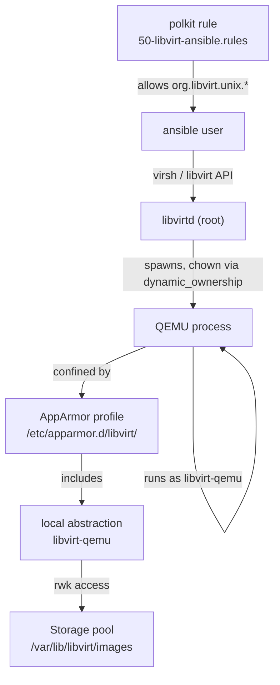
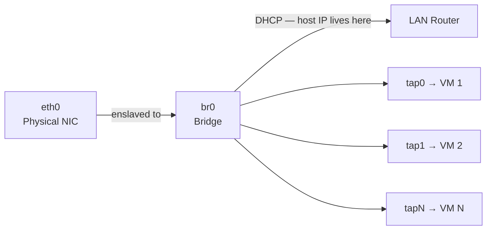

# Ansible — Hypervisor Bootstrap

Two-phase bootstrap of a Debian 13 host: first create an ansible service account, then configure libvirt, QEMU, AppArmor, and bridge networking.

## Workflow

```
flowchart LR
    S[setup.env] -->|just configure| I[inventory.local.yaml]
    I -->|just ansible prepare-host --user root -k| P[prepare_host role\ncreates ansible user]
    P -->|just ansible configure-libvirt| C[common role]
    C --> L[libvirt_host role]
    L --> R[Hypervisor ready]
```


## Usage

```bash
just configure                               # generate inventory.local.yaml from setup.env
just ansible prepare-host --user root -k    # phase 1: create ansible user (run as root)
just ansible configure-libvirt              # phase 2: configure libvirt and networking
just ansible configure-libvirt --check      # dry run
```

Once `prepare-host` has run you can set `HYPERVISOR_USER=ansible` in `setup.env` and regenerate the inventory.

## Security model

QEMU processes run as `libvirt-qemu` (not root) and are confined by a per-VM AppArmor profile generated by `virt-aa-helper`. The local abstraction at `/etc/apparmor.d/local/abstractions/libvirt-qemu` grants the profile access to the storage pool. `dynamic_ownership = 1` lets libvirtd `chown` disk images to `libvirt-qemu:kvm` at domain start.



## Network topology

VMs share the host subnet by bridging the physical NIC. NetworkManager manages the bridge.



## Roles

### `prepare_host`

Creates an `ansible` service account with passwordless sudo and optional SSH authorized keys. Intended to run once as root.

| Variable                       | Default     | Description                              |
|-------------------------------|-------------|------------------------------------------|
| `prepare_host_user`           | `ansible`   | Username to create                       |
| `prepare_host_ssh_public_keys`| `[]`        | List of SSH public keys to authorize     |

Set `prepare_host_ssh_public_keys` in `inventory.local.yaml` under `vars:`.

### `common`

Installs system utilities. Add packages to `roles/common/defaults/main.yaml`.

### `libvirt_host`

1. Installs QEMU, libvirt, and AppArmor packages
2. Enables AppArmor and libvirtd
3. Creates `libvirt` and `kvm` groups; adds management user to both
4. Configures `/etc/libvirt/qemu.conf` (user, group, dynamic_ownership, security_driver)
5. Writes polkit rule granting the management user full libvirt access
6. Writes AppArmor local abstraction for the storage pool path
7. Configures a host bridge via NetworkManager

| Variable                      | Default                    | Description                               |
|------------------------------|----------------------------|-------------------------------------------|
| `libvirt_user`               | `ansible_user`             | User added to libvirt/kvm groups          |
| `libvirt_user_groups`        | `[libvirt, kvm]`           | Groups to add the user to                 |
| `libvirt_service`            | `libvirtd`                 | libvirt service name                      |
| `libvirt_packages`           | see defaults               | Packages to install                       |
| `apparmor_packages`          | `[apparmor, apparmor-utils]` | AppArmor packages to install            |
| `libvirt_qemu_user`          | `libvirt-qemu`             | User QEMU processes run as               |
| `libvirt_qemu_group`         | `kvm`                      | Group QEMU processes run as              |
| `libvirt_qemu_dynamic_ownership` | `1`                   | chown disk images to qemu user at start  |
| `libvirt_security_driver`    | `apparmor`                 | MAC security driver for QEMU             |
| `libvirt_pool_path`          | `/var/lib/libvirt/images`  | Storage pool path AppArmor allows        |
| `libvirt_bridge_name`        | `br0`                      | Bridge interface name                    |
| `libvirt_bridge_configure`   | `true`                     | Set to `false` to skip bridge setup      |

## Structure

```
prepare-host.yaml                phase 1 playbook
site.yaml                        phase 2 playbook (configure-libvirt)
inventory.yaml                   envsubst template — generate with `just configure`
roles/
  prepare_host/
    defaults/main.yaml           prepare_host_user, prepare_host_ssh_public_keys
    tasks/main.yaml              Create user, sudoers, authorized_key
  common/
    defaults/main.yaml           common_packages list
    tasks/main.yaml              apt install
  libvirt_host/
    defaults/main.yaml           All tunable variables
    tasks/main.yaml              Packages, AppArmor, qemu.conf, polkit, bridge
    handlers/main.yaml           Reload AppArmor, restart libvirtd/polkit/NM
```
