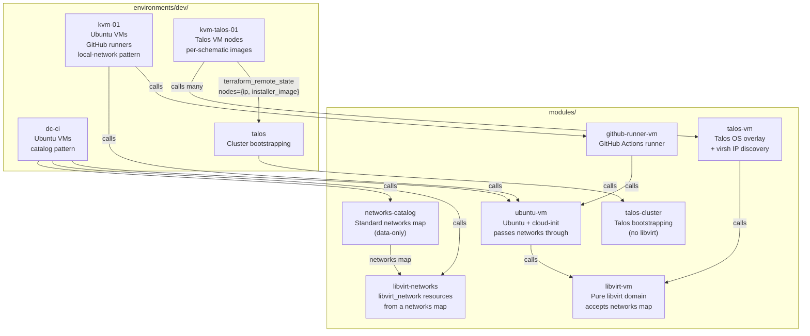
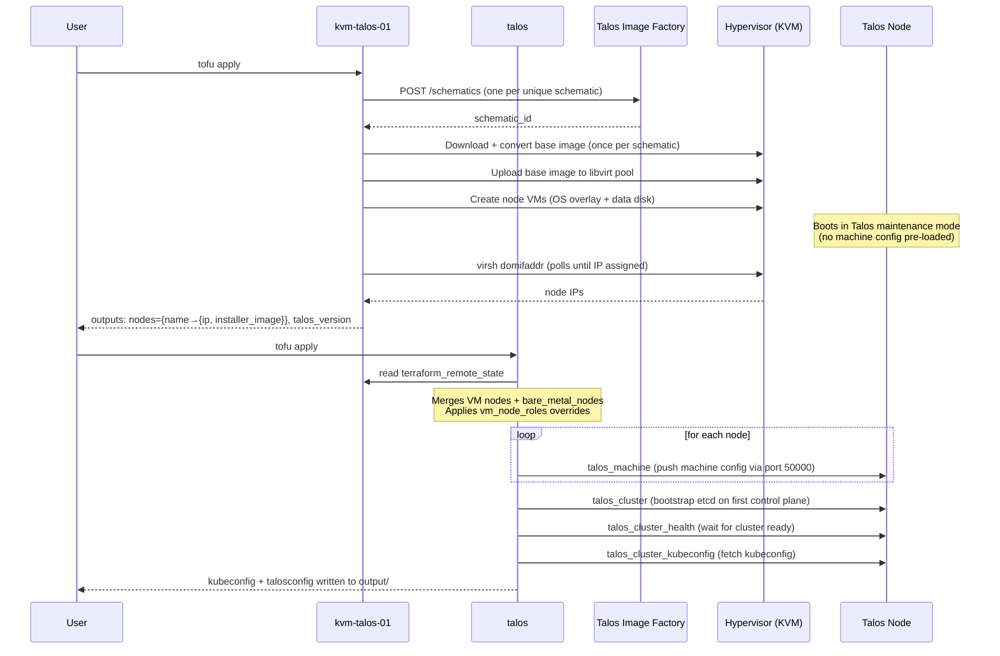

# OpenTofu — Infrastructure as Code

OpenTofu manages VMs on KVM hypervisors via the libvirt provider. The primary use case is a non-homogeneous Talos
Kubernetes cluster — nodes of different sizes, different hardware extensions (GPUs, cameras), some on VMs and some
bare-metal — all managed from a single `talos apply`.

---

## Architecture overview



The two-environment split for Talos is deliberate: `kvm-talos-01` manages libvirt resources (pool, base images, VMs)
while `talos` manages cluster bootstrapping (machine config, etcd, kubeconfig). They communicate via
`terraform_remote_state`.

---

## Talos cluster workflow



**Apply order is mandatory:** `kvm-talos-01 apply` must complete before `talos apply`. The `talos` environment reads
`kvm-talos-01`'s statefile directly — if it does not exist yet, `tofu plan` will fail.

---

## Non-homogeneous cluster

The design supports clusters where nodes differ in:

| Dimension                         | How it is handled                                                                             |
|-----------------------------------|-----------------------------------------------------------------------------------------------|
| Size (CPU / RAM / disk)           | Per-node overrides in `kvm-talos-01` `nodes` map                                              |
| Hardware extensions (GPU, camera) | Per-node `schematic_path` → unique base image per schematic                                   |
| VM vs. bare-metal                 | VM nodes come from `kvm-talos-xx` state; bare-metal from `bare_metal_nodes` in `talos` tfvars |
| Role (controlplane vs. worker)    | `vm_node_roles` override map in `talos` tfvars                                                |
| Per-node kernel / driver config   | `config_patches` list of raw Talos YAML in `bare_metal_nodes` or `vm_node_config_patches`     |

### Example: GPU worker + bare-metal node

**`kvm-talos-01/schematics/nvidia.yaml`**

```yaml
customization:
  systemExtensions:
    officialExtensions:
      - siderolabs/qemu-guest-agent
      - siderolabs/nonfree-kmod-nvidia-production
      - siderolabs/nvidia-container-toolkit-production
```

**`kvm-talos-01/terraform.tfvars`**

```hcl
image = {
  version = "v1.12.0"
}

nodes = {
  # Standard control plane nodes — use schematics/default.yaml implicitly
  "cp-00" = {}
  "cp-01" = {}
  "cp-02" = {}

  # GPU worker — larger, different schematic, DHCP reservation via MAC
  "gpu-00" = {
    schematic_path = "schematics/nvidia.yaml"
    memory_mb      = 32768
    vcpu           = 8
    data_disk_gb   = 100
    mac_address    = "52:54:00:ab:cd:ef"
  }
}
```

**`talos/terraform.tfvars`**

```hcl
cluster = {
  name               = "homelab"
  vip                = "192.168.1.99"
  kubernetes_version = "v1.32.0"
}

talos_version = "v1.12.0"

kvm_talos_state_paths = {
  kvm-talos-01 = "../kvm-talos-01/terraform.tfstate"
}

# Make gpu-00 a worker (all VM nodes default to controlplane)
vm_node_roles = {
  "gpu-00" = "worker"
}

# NVIDIA kernel modules config for the GPU node
vm_node_config_patches = {
  "gpu-00" = [
    <<-YAML
      machine:
        kernel:
          modules:
            - name: nvidia
            - name: nvidia_uvm
            - name: nvidia_drm
            - name: nvidia_modeset
    YAML
  ]
}

# Bare-metal worker not managed by any kvm-talos-xx state
bare_metal_nodes = {
  "bm-worker-00" = {
    ip              = "192.168.1.55"
    role            = "worker"
    installer_image = "factory.talos.dev/installer/e9c7ef96b4e73879abb284bfd73373c5b84abd5e:v1.12.0"
    config_patches = []
  }
}
```

---

## Per-node schematics

Schematics live under `kvm-talos-01/schematics/` (or any path relative to the environment root). The default schematic
is `schematics/default.yaml`.

```
kvm-talos-01/
└── schematics/
    ├── default.yaml    # qemu-guest-agent only (all standard nodes)
    ├── nvidia.yaml     # qemu-guest-agent + NVIDIA extensions
    └── camera.yaml     # qemu-guest-agent + camera kernel modules
```

The environment makes **one HTTP call per unique schematic** to the Talos image factory, downloads and converts **one
base image per unique schematic**, and uploads it to the libvirt pool. All nodes sharing a schematic share the same base
image via qcow2 copy-on-write overlay. Adding a new schematic only costs one extra image.

---

## Multi-hypervisor clusters

To add a second KVM hypervisor, copy the `kvm-talos-01/` environment and register it:

**`tofu/justfile`**

```
mod dev-kvm-talos-02 "environments/dev/kvm-talos-02/justfile"
```

**`talos/terraform.tfvars`**

```hcl
kvm_talos_state_paths = {
  kvm-talos-01 = "../kvm-talos-01/terraform.tfstate"
  kvm-talos-02 = "../kvm-talos-02/terraform.tfstate"
}
```

Node names must be unique across all hypervisors. The `talos` environment merges all `kvm-talos-xx` state outputs into a
single flat map before calling `talos-cluster`.

---

## Configuration reference

### `environments/dev/kvm-talos-01`

Manages Talos VM nodes on a single KVM hypervisor. Outputs node IPs and installer images for the `talos` environment.

#### Variables

| Variable                       | Type          | Default                                | Description                                                                                                                                                                 |
|--------------------------------|---------------|----------------------------------------|-----------------------------------------------------------------------------------------------------------------------------------------------------------------------------|
| `libvirt_uri`                  | `string`      | —                                      | libvirt connection URI, e.g. `qemu+ssh://user@host/system`                                                                                                                  |
| `vm_bridge_interface`          | `string`      | `"br0"`                                | Host bridge interface VMs attach to                                                                                                                                         |
| `pool_name`                    | `string`      | `"tofu-talos"`                         | libvirt storage pool name                                                                                                                                                   |
| `pool_path`                    | `string`      | `"/var/lib/libvirt/images/tofu-talos"` | Filesystem path on the hypervisor for the pool                                                                                                                              |
| `cluster_vip`                  | `string`      | `null`                                 | Cluster VIP to exclude from IP discovery. Leave `null` until after first bootstrap; set in tfvars on subsequent applies so the VIP is not mistaken for a node's primary IP. |
| `image.factory_url`            | `string`      | `"https://factory.talos.dev"`          | Talos image factory base URL                                                                                                                                                |
| `image.version`                | `string`      | —                                      | Talos version, e.g. `"v1.12.0"`                                                                                                                                             |
| `image.platform`               | `string`      | `"nocloud"`                            | Image platform                                                                                                                                                              |
| `image.arch`                   | `string`      | `"amd64"`                              | Image architecture                                                                                                                                                          |
| `image.default_schematic_path` | `string`      | `"schematics/default.yaml"`            | Default schematic for nodes that do not specify one                                                                                                                         |
| `nodes`                        | `map(object)` | —                                      | Node definitions — see below                                                                                                                                                |
| `node_vcpu`                    | `number`      | `4`                                    | Default vCPU count (overridable per node)                                                                                                                                   |
| `node_memory_mb`               | `number`      | `6144`                                 | Default RAM in MiB (overridable per node)                                                                                                                                   |
| `node_os_disk_gb`              | `number`      | `12`                                   | Default OS disk in GiB (overridable per node)                                                                                                                               |
| `node_data_disk_gb`            | `number`      | `24`                                   | Default data disk in GiB (overridable per node)                                                                                                                             |

#### `nodes` object fields

| Field            | Type     | Default | Description                                                                                |
|------------------|----------|---------|--------------------------------------------------------------------------------------------|
| `schematic_path` | `string` | `null`  | Path to schematic YAML relative to env root. Falls back to `image.default_schematic_path`. |
| `mac_address`    | `string` | `null`  | MAC address for DHCP reservations                                                          |
| `vcpu`           | `number` | `null`  | vCPU count; falls back to `node_vcpu`                                                      |
| `memory_mb`      | `number` | `null`  | RAM in MiB; falls back to `node_memory_mb`                                                 |
| `os_disk_gb`     | `number` | `null`  | OS disk size; falls back to `node_os_disk_gb`                                              |
| `data_disk_gb`   | `number` | `null`  | Data disk size; falls back to `node_data_disk_gb`                                          |

#### Outputs

| Output          | Type                         | Description                                                                            |
|-----------------|------------------------------|----------------------------------------------------------------------------------------|
| `nodes`         | `map({ip, installer_image})` | Per-node IP and installer image URL — consumed by `talos` via `terraform_remote_state` |
| `talos_version` | `string`                     | Talos version deployed to these nodes                                                  |

---

### `environments/dev/talos`

Bootstraps the Talos cluster. Reads VM node state from one or more `kvm-talos-xx` environments and optionally merges in
bare-metal nodes.

#### Variables

| Variable                     | Type                | Default                                                | Description                                                          |
|------------------------------|---------------------|--------------------------------------------------------|----------------------------------------------------------------------|
| `cluster.name`               | `string`            | —                                                      | Cluster name                                                         |
| `cluster.vip`                | `string`            | —                                                      | Virtual IP for the Kubernetes API endpoint                           |
| `cluster.kubernetes_version` | `string`            | `"v1.32.0"`                                            | Kubernetes version                                                   |
| `talos_version`              | `string`            | —                                                      | Talos version; must match `kvm-talos-xx`                             |
| `kvm_talos_state_paths`      | `map(string)`       | `{kvm-talos-01 = "../kvm-talos-01/terraform.tfstate"}` | Hypervisor label → relative path to statefile                        |
| `vm_node_roles`              | `map(string)`       | `{}`                                                   | Role overrides for VM nodes. All VM nodes default to `controlplane`. |
| `vm_node_config_patches`     | `map(list(string))` | `{}`                                                   | Per-node extra Talos config patches (raw YAML strings) for VM nodes  |
| `bare_metal_nodes`           | `map(object)`       | `{}`                                                   | Bare-metal or pre-provisioned nodes not in any `kvm-talos-xx` state  |
| `output_dir`                 | `string`            | `null`                                                 | Where to write kubeconfig + talosconfig. Defaults to `./output`.     |

#### `bare_metal_nodes` object fields

| Field             | Type           | Default          | Description                                                               |
|-------------------|----------------|------------------|---------------------------------------------------------------------------|
| `ip`              | `string`       | —                | Node IP address                                                           |
| `role`            | `string`       | `"controlplane"` | `controlplane` or `worker`                                                |
| `installer_image` | `string`       | —                | Full installer image URL, e.g. `factory.talos.dev/installer/<id>:v1.12.0` |
| `config_patches`  | `list(string)` | `[]`             | Raw Talos config YAML patches for hardware-specific config                |

#### Outputs

| Output                | Description                     |
|-----------------------|---------------------------------|
| `cluster_endpoint`    | Kubernetes API endpoint URL     |
| `control_plane_nodes` | List of control plane node IPs  |
| `kubeconfig_path`     | Path to the written kubeconfig  |
| `talosconfig_path`    | Path to the written talosconfig |

---

### `modules/talos-cluster`

Pure Talos cluster bootstrapping — no libvirt resources. Accepts pre-discovered node IPs.

#### Variables

| Variable                     | Type          | Default     | Description                                   |
|------------------------------|---------------|-------------|-----------------------------------------------|
| `cluster.name`               | `string`      | —           | Cluster name                                  |
| `cluster.vip`                | `string`      | —           | VIP for the Kubernetes API                    |
| `cluster.kubernetes_version` | `string`      | `"v1.32.0"` | Kubernetes version                            |
| `talos_version`              | `string`      | —           | Talos version for machine configuration       |
| `output_dir`                 | `string`      | `null`      | Output directory for kubeconfig + talosconfig |
| `nodes`                      | `map(object)` | —           | Cluster nodes — see below                     |

#### `nodes` object fields

| Field             | Type           | Default          | Description                                                |
|-------------------|----------------|------------------|------------------------------------------------------------|
| `ip`              | `string`       | —                | Node IP                                                    |
| `role`            | `string`       | `"controlplane"` | `controlplane` or `worker`                                 |
| `installer_image` | `string`       | —                | Talos installer image URL (schematic-specific)             |
| `config_patches`  | `list(string)` | `[]`             | Raw Talos config YAML patches applied after the role patch |

**Key design notes:**

- `installer_image` is per-node, enabling heterogeneous schematics within a single cluster.
- `config_patches` are appended after the role-specific patch. Use for GPU drivers, kernel modules, PCIe passthrough,
  etc.
- Nodes must boot in Talos maintenance mode — machine config is pushed via port 50000 by `talos_machine`.
- The kubeconfig from the previous apply is read back to enable `drain_on_upgrade` without a circular dependency. Drain
  is skipped on the first apply (no kubeconfig yet).
- Use `tofu apply -parallelism=1` for OS upgrades to preserve etcd quorum during rolling control-plane restarts.

---

### `modules/talos-vm`

Wraps `libvirt-vm` for Talos nodes. Creates an OS disk (qcow2 overlay on a shared base image) and a separate data disk.
Boots in Talos maintenance mode — no machine config is embedded.

#### Variables

| Variable            | Type     | Default | Description                                                              |
|---------------------|----------|---------|--------------------------------------------------------------------------|
| `name`              | `string` | —       | VM name (also used for volume and domain names)                          |
| `pool_name`         | `string` | —       | libvirt pool for all volumes                                             |
| `base_image_path`   | `string` | —       | Hypervisor path to the Talos base qcow2 (backing store)                  |
| `vcpu_count`        | `number` | `4`     | Virtual CPUs                                                             |
| `memory_mb`         | `number` | `6144`  | RAM in MiB                                                               |
| `os_disk_size_gb`   | `number` | `12`    | OS disk size in GiB                                                      |
| `data_disk_size_gb` | `number` | `24`    | Data disk size in GiB                                                    |
| `bridge`            | `string` | —       | Host bridge interface                                                    |
| `mac_address`       | `string` | `null`  | NIC MAC address for DHCP reservations                                    |
| `ssh_target`        | `string` | —       | `user@host` for virsh IP discovery over SSH                              |
| `cluster_vip`       | `string` | `null`  | VIP to exclude from IP discovery. Safe to leave `null` before bootstrap. |

#### Outputs

| Output       | Description                               |
|--------------|-------------------------------------------|
| `ip_address` | DHCP-assigned IPv4 (discovered via virsh) |
| `name`       | VM domain name                            |
| `uuid`       | libvirt domain UUID                       |

**IP discovery:** Uses `virsh domifaddr --source agent` over SSH, polling every 5 seconds for up to 5 minutes. The
libvirt guest-agent data source is not used because once a node joins a cluster it reports Kubernetes-internal
interfaces (VIP, Cilium, etc.) alongside the physical NIC. The virsh script filters to physical NIC names (`eth*`,
`enp*`, `ens*`) and excludes the VIP.

---

## Ubuntu VMs

Two environments run Ubuntu 24.04 LTS VMs; they differ only in how they source their networks.

### `environments/dev/dc-ci` (catalog pattern — recommended)

Uses the shared `networks-catalog` module for standard networks (bridge, management, isolated) and the
`libvirt-networks` module to materialize `libvirt_network` resources. Each VM's `networks` map selects
catalog entries and can override per-NIC config (static_ip, mac_address, ...).

```hcl
# dc-ci/terraform.tfvars
bridge_interface = "br0"

ubuntu_vms = {
  ubuntu-01 = {
    networks = {
      bridge = { static_ip = "10.0.1.163/16" }
      management = {}
    }
  }
  web-01 = {
    extra_packages = ["nginx"]
    networks = {
      bridge = { static_ip = "10.0.1.164/16", mac_address = "52:54:00:11:22:33" }
      management = {}
    }
  }
}
```

Unset fields (`static_ip`, `mac_address`, etc.) fall through to the catalog defaults. To evolve the fleet-wide
catalog (subnets, gateways, DNS), edit `modules/networks-catalog/outputs.tofu`.

### `environments/dev/kvm-01` (local-network pattern — legacy)

Networks defined inline as `libvirt_network` resources. Each VM picks one via a `network_name` scalar. Kept for
existing state; new environments should follow the `dc-ci` pattern.

```hcl
# kvm-01/terraform.tfvars
ubuntu_vms = {
  "dev-01" = { memory_mb = 4096 }
  "web-01" = { extra_packages = ["nginx"] }
  "db-01" = { memory_mb = 8192, os_disk_size_gb = 50, network_name = "isolated" }
}

github_runners = {
  "runner-01" = {
    github_url     = "https://github.com/myorg/myrepo"
    runner_version = "2.321.0"
    memory_mb      = 8192
  }
}
```

### `ubuntu-vm` module variables

| Variable          | Default | Description                                                                |
|-------------------|---------|----------------------------------------------------------------------------|
| `memory_mb`       | `2048`  | RAM in MiB                                                                 |
| `vcpu_count`      | `2`     | Virtual CPUs                                                               |
| `os_disk_size_gb` | `20`    | Root disk in GiB                                                           |
| `extra_packages`  | `[]`    | apt packages to install at first boot                                      |
| `networks`        | —       | Map of NICs; per-entry `static_ip` (CIDR), `gateway`, `dns_servers`, `mac_address`, `wait_for_ip` |
| `write_files`     | `[]`    | Files to create via cloud-init `write_files`                               |
| `extra_runcmd`    | `[]`    | Shell commands appended to cloud-init `runcmd`                             |

The first bridge-mode entry in `networks` (or the first entry alphabetically if none is a bridge) is the "primary"
NIC — it receives the default route and DNS from either its own `gateway`/`dns_servers` fields or from DHCP.
Non-primary NICs get DHCP with `use-routes: false, use-dns: false` so they don't fight for the default route.

---

## Justfile commands

All commands run from `tofu/` via the `just` task runner.

```bash
# Talos VM nodes — run first
just dev-kvm-talos-01 init
just dev-kvm-talos-01 plan
just dev-kvm-talos-01 apply
just dev-kvm-talos-01 ips              # print discovered node IPs
just dev-kvm-talos-01 console cp-00   # open virsh console (exit with Ctrl+])

# Talos cluster bootstrap — run after kvm-talos-01
just dev-talos init
just dev-talos plan
just dev-talos apply
just dev-talos kubectl get nodes
just dev-talos talosctl health

# Ubuntu VMs
just dev init
just dev apply

# Legacy standalone Talos root module (existing state — keep, do not delete)
just talos apply
```

---

## First-time setup

```bash
# 1. Bootstrap the hypervisor (from repo root)
just ansible bootstrap

# 2. Configure kvm-talos-01 tfvars
cd tofu/environments/dev/kvm-talos-01
cp terraform.tfvars.example terraform.tfvars
# edit: set libvirt_uri, vm_bridge_interface, image.version, nodes

# 3. Configure talos tfvars
cd ../talos
cp terraform.tfvars.example terraform.tfvars
# edit: set cluster.name, cluster.vip, talos_version

# 4. Apply in order (from tofu/)
just dev-kvm-talos-01 apply
just dev-talos apply
```

Kubeconfig and talosconfig are written to `environments/dev/talos/output/`.

---

## File conventions

- All OpenTofu config uses `.tofu` extension (not `.tf`). Templates use `.tftpl`.
- `terraform.tfvars` is gitignored; `terraform.tfvars.example` is the reference.
- Every module declares `required_providers` in its own `versions.tofu`. OpenTofu does not inherit provider source from
  the root module — omitting it causes a lookup for `hashicorp/libvirt`, which does not exist.
